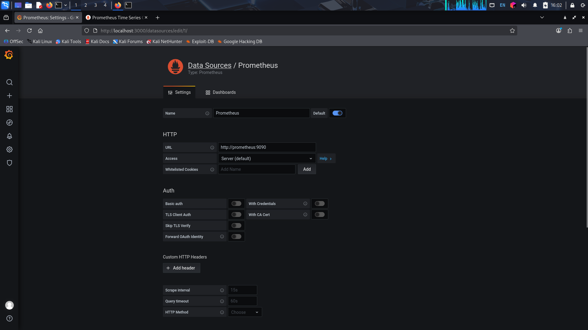
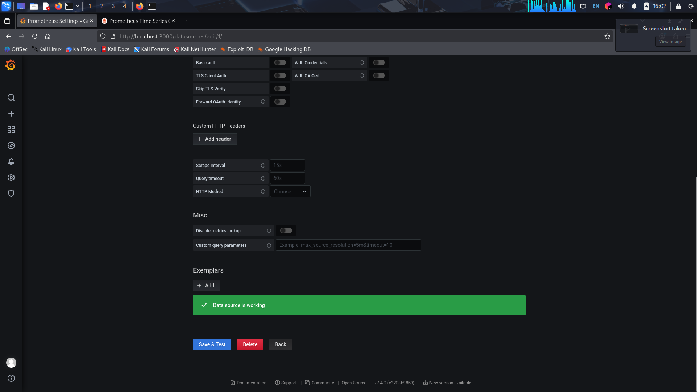
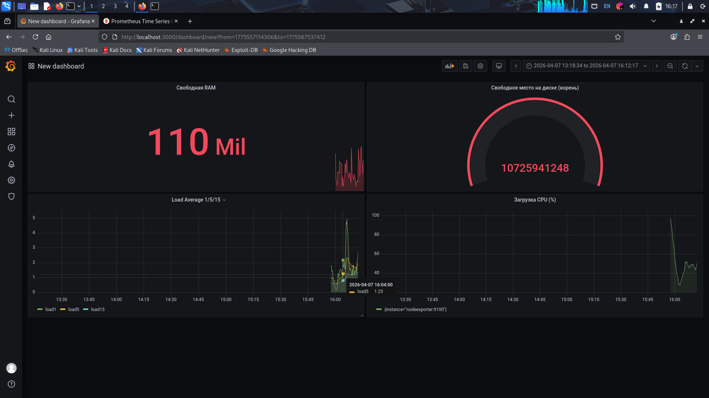
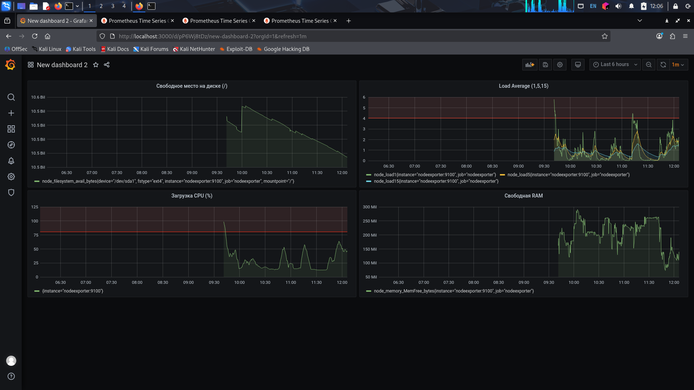
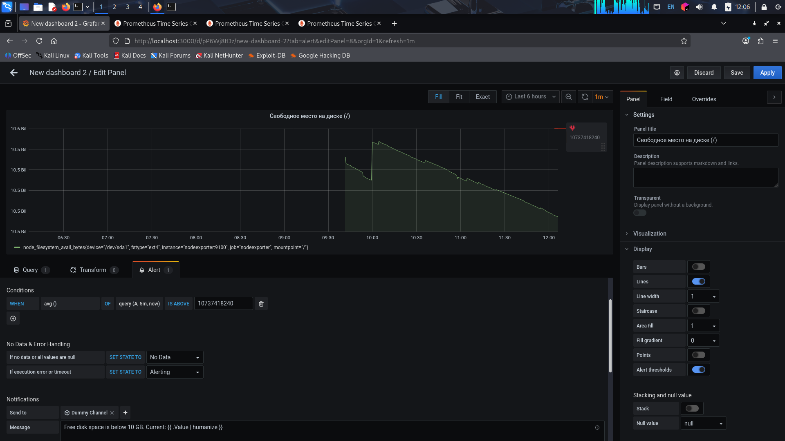
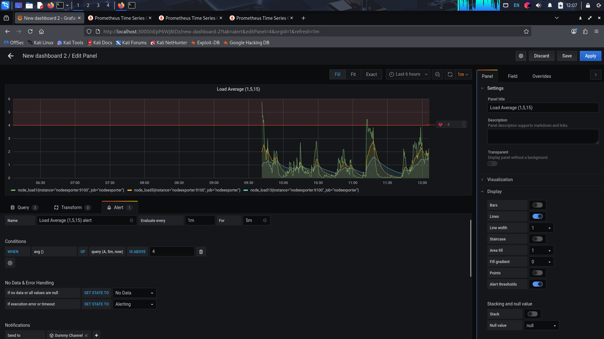
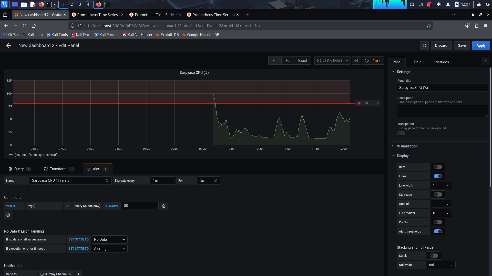
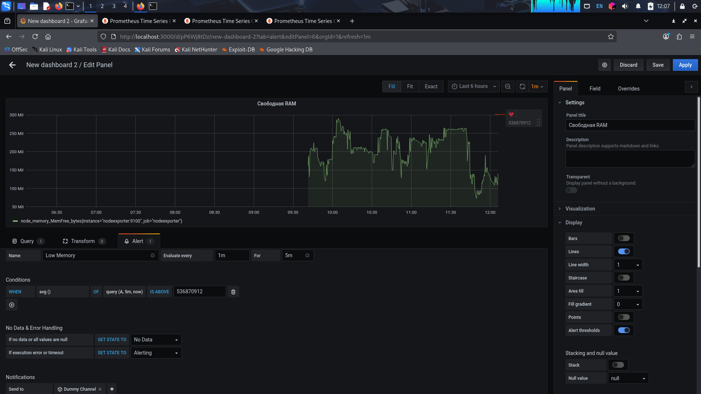

# Домашнее задание к занятию 14 «Средство визуализации Grafana»

## Задание 1. Подключение Prometheus в качестве источника данных

- Настройки источника данных:  
  
- Список источников данных:  
  

## Задание 2. Создание дашборда с панелями

- Дашборд с метриками:  
  

**Использованные запросы PromQL:**

- Загрузка ЦП: `100 - (avg by (instance) (rate(node_cpu_seconds_total{mode="idle"}[5m])) * 100)`
- Средняя загрузка: `node_load1`, `node_load5`, `node_load15`
- Свободная оперативная память: `node_memory_MemFree_bytes`
- Свободное место на диске: `node_filesystem_avail_bytes{mountpoint="/", fstype!~"rootfs|tmpfs"}`

## Задание 3. Правила оповещения

- Порог на панели Загрузка ЦП:  
  
- Порог на панели Средняя нагрузка:  
  
- Порог на панели Свободная оперативная память:  
  
- Порог на панели Свободное место на диске:  
  
- Общий вид дашборда с активными оповещениями (красные зоны):  
  

## Задание 4. Экспорт дашборда в JSON

- Файл с JSON-моделью дашборда:  
  [`dashboard_listing.json`](dashboard_listing.json)
